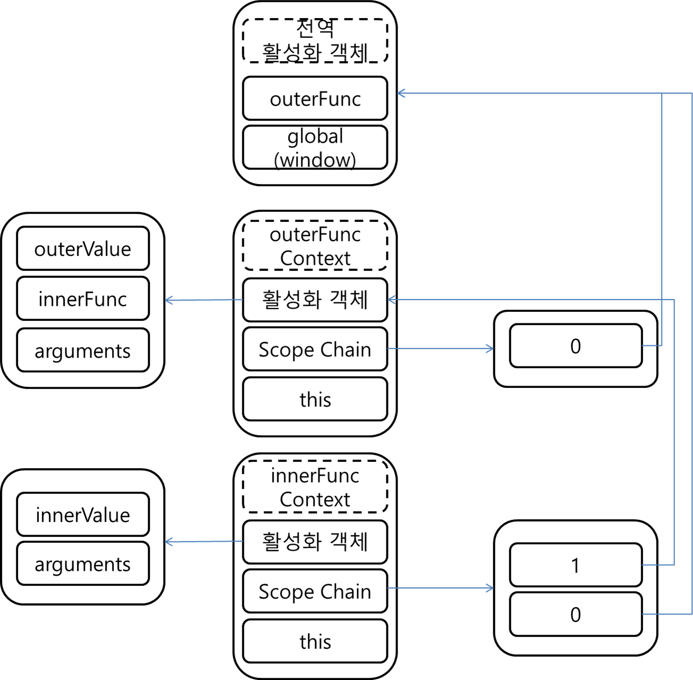

# Hoisting
JavaScript에서 변수선언과 동시에 할당할경우 **선언과 할당으로 분리된다.**
이때, 분리되면서 선언부분은 해당 유효범위의 최상위로 호이스트된다.

```js
function myFunc(){
	console.log(value);	
	//아예 Exception이 일어나야할거같지만 undefined가 나타난다.
	//하단의 코드가 선언과 할당으로 분리되고 선언부분이 최상위로 호이스트됐기 때문이다.
	var value = 'myFunc value'; 
	//호이스트됐기때문에 위 코드는 할당역할만 한다.
	console.log(value);
	//할당됐기때문에 myFunc value 출력된다.
}
```

# Scope
JavaScript에서의 유효범위를 뜻한다. JavaScript는 Scope를 통해 어디에서 어디변수에 접근가능한지를 결정한다.
- 함수 수준 유효범위
```js
//블럭이 아니라 함수수준의 유효범위를 갖는다.

var value = "window's value";
function myFunc(){
	var value = "myFunc's value";
	console.log('inner value : '+value);	//myFunc's value
};
myFunc();
console.log('outer value : '+value);	//window's value

if(true){
	value = 'changed value in branch';
	console.log('value in branch : '+value);	//changed value in branch
}
console.log('last value : '+value);	//changed value in branch
```

# Execution Context (실행문맥) & Scope Chain
Javascript에서 실행문맥이라함은 함수가 실행될때 필요한 정보들을 가지고있는 객체(?)이다.
중첩으로 함수가 실행될때는 스택에 실행문맥이 쌓이며 이 실행문맥속의 Scope Chain을 탐색해서
유효한 스코프 변수를 찾아내어 사용한다.
```js
var outerFunc(param1,param2){
	var outerValue = 10;
	function innerFunc(){
		var innerValue = 30;
		alert(innerValue);
	}
}
outerFunc(40,50);
```
위 예제의 Context와 Scope Chain은 아래와 같다.



# Closure
MDN에서의 클로저는 **환경을 기억하는것**이라고 정의한다.**
클로저가 나타나는 기본적인 환경은 **function안에 function이 다시 선언되었을때이다.**
즉, 호출된 외부함수(outer)가 리턴된 이후에도 호출된 외부함수(outer)의 내부함수(inner)가 외부함수의 변수(value)에 접근하고 있다는 것이다.
보통 클로저는 전역변수가 더럽혀지는걸 방지하기 위한 용도로 많이 사용된다.
```js
function outer(){
	var value='outer value';
	function inner(){
		return value;
	}
	return inner;
}
var myFunc = outer();
myFunc();	//outer value
```


## Closure로 private 흉내내기 (모듈패턴)
```js
var func = (function(){
	var value = 10;
	var changeValue = function(val){
		value += val;
	};
	return {
		add : function(){
			changeValue(1);
		},
		sub : function(){
			changeValue(-1);
		},
		get : function(){
			return value;
		}
	}
})();

func.add();	//+1
func.sub();	//-1
func.sub();	//-1
alert(func.get());	//9
alert(func.value);	//not defined error
```

## 반복문에 클로저사용의 흔한 실수
반복문의 i를 가지고 콜백함수를 지정하는 실수를 많이 저지르곤한다.
```js
for (var i = 0; i < 10; i++) {
	$('.cls_name').onclick(function(){
		console.log(i);
	});
}
//10만 10번 출력
```
이 경우에는 콜백함수가 실행될때 스코프체인으로 **상위 context의 활성화 객체를 참조하여** i를 사용하게되는데
이때 이 context는 **반복문이 종료된 상태를 저장하고 있기때문에** 의도하지 않은 하나의 값만이 출력될것이다.

해결책은 반복문의 loop가 돌때마다의 상태를 저장하고있는 각각의 context에 i를 따로 저장하고있어야한다.
**이는 즉시 실행함수로 구현가능하다.**
```js
for (var i = 0; i < 10; i++) {
	$('.cls_name').onclick(function(){
		(function(j){
			console.log(j);
		})(i);
	});
}
//10만 10번 출력
```
위와 같이 즉시실행함수로 구현하게되면 **반복문의 i를 즉시실행함수의 context의 활성화객체에 j라는 값으로 다시 저장되며 이 상태가 각각 저장되기 때문에** 의도한대로 동작하게 된다.
